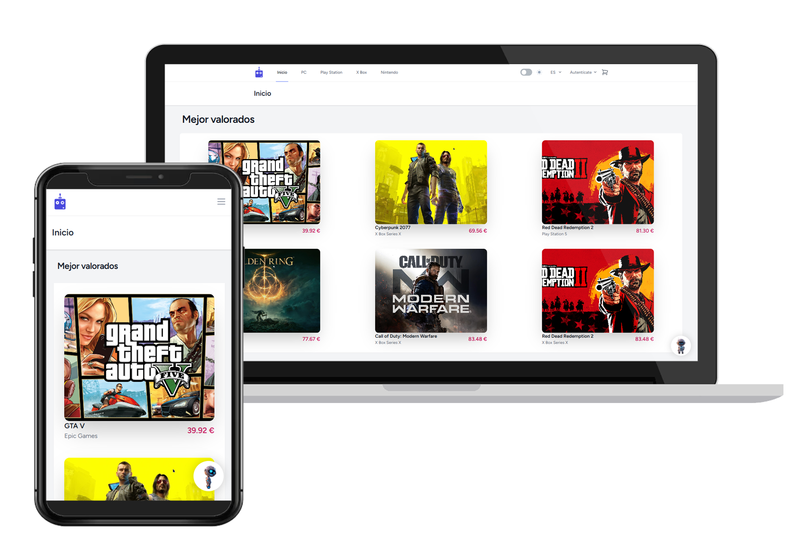

<h1 align="center">
  🤖 Nexus Play
</h1>

<p align="center">
    
</p>

[](https://forthebadge.com) &nbsp;
[](https://forthebadge.com) &nbsp;
 &nbsp;

## Introduction

This project is a comprehensive web application developed using the **Laravel** framework.

Its primary aim is to facilitate the *sale of digital video game licenses*,
ensuring a seamless and secure user experience for both buyers and sellers of digital video game content.

## Environment Requirements

To run this project, you need to have a **LAMP** stack (Linux, Apache, MySQL, PHP) and **Node.js** configured in your development environment. The specific requirements are as follows:

- Apache
- MySQL
- PHP 8.x
- Composer
- Node.js

## Quick Installation

Follow these steps to set up and run the project in your local environment.

### Clone the Repository

Clone the repository to your local machine:

```bash
git clone https://github.com/raulv7z/nexus-play-proj.git
```

### Configure the .env File

Copy the `.env.example` file to `.env` and configure the necessary values in the `.env` file. You can use the following command to copy the file:

```bash
cp .env.example .env
```

Make sure to configure the database connection and other necessary values in the `.env` file.

### Install Dependencies

Install **PHP** and **Node.js** dependencies using Composer and npm:

```bash
composer install
npm install
```

### Run Migrations and Seeders

Run the database migrations and seeders to populate the initial records:

```bash
php artisan migrate --seed
```
### Add resources

Download real images from games and add it to their storage/ folder.
Thereafter link the storage folder to public/ folder following the command:

```bash
php artisan storage:link
```

## Running the Application

After completing the above steps, you can start the Laravel development server:

```bash
php artisan serve
```

By default, the application will be available at http://localhost:8000.

For development, run the following command to compile your assets:

```bash
npm run dev
```
## Documentation

For detailed documentation, please refer to the files located in the [docs directory](metadata/docs/) within the [metadata folder](metadata).

The documentation is available in **PDF** format and is currently only available in **Spanish**.

## License
Nexus Play © 2024 by raulv7z is licensed under CC BY-NC 4.0.

For more details, please refer to the [license terms](http://creativecommons.org/licenses/by-nc/4.0/) or the [LICENSE](https://github.com/raulv7z/nexus-play/blob/main/LICENSE) file.
